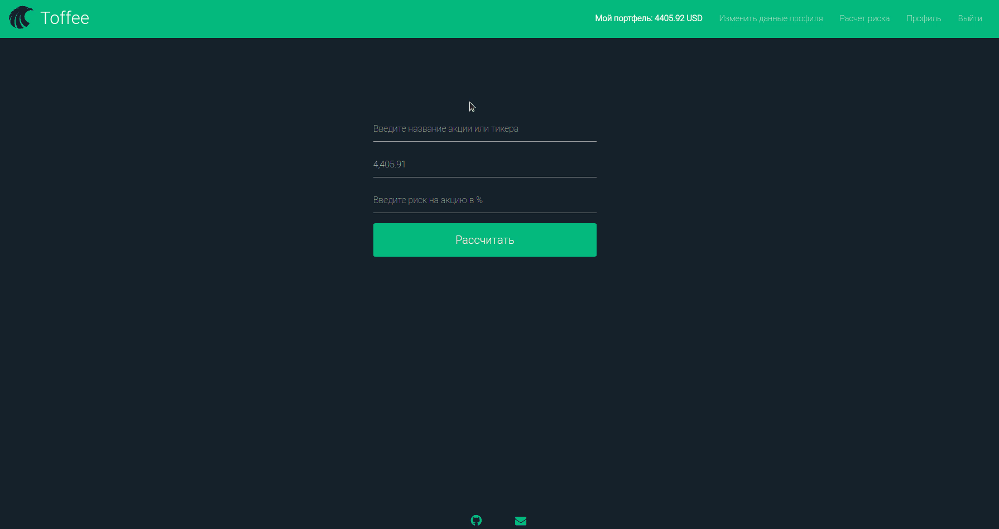
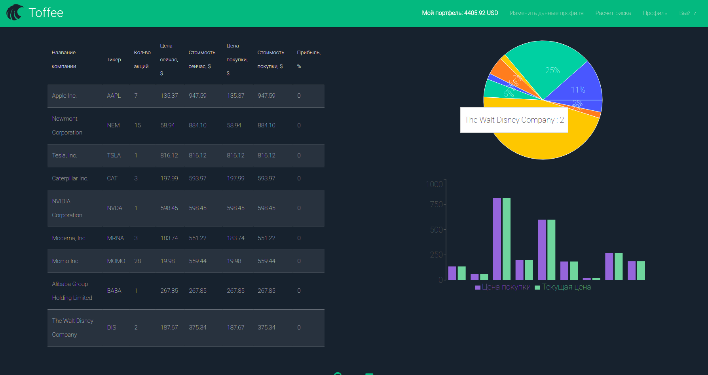

<h1>Toffee</h1>

"Toffee" - риск-менеджер для акций американского фондового рынка.

<h2>Возможности приложения:</h2>

- Получение графиков и realtime данных по цене интересующих акций:

  

- Расчет допустимого числа акций по каждой компании при заданном депозите и уровне риска

- Ведение портфеля с отслеживанием общей доходности и доходности по каждому отдельному активу

<h2>Стек технологий</h2>
<ul>
  <li>React JS</li>
  <li>Redux, Redux-Thunk</li>
  <li>MongoDB</li>
  <li>Express</li>
  <li>Recharts - React charting library</li>
  <li>Financial Modeling Prep API</li>
  <li>Amazon Web Services</li>
  <li>Nginx</li>
</ul>

Watch at: http://3.129.89.208
